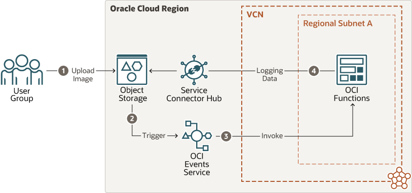

# terraform-oci-arch-fn-app

Oracle Functions is a serverless, highly scalable, fully managed Functions-as-a-Service platform built on Oracle Cloud Infrastructure and powered by the open-source Fn Project engine. Developers can use Oracle Functions to write and deploy code that delivers business value without worrying about provisioning or managing the underlying infrastructure. Oracle Functions is container-native, with functions packaged as Docker container images.

This reference architecture shows how you can use a serverless function to in response to cloud events. 

The architecture diagram shows the data flow. When files are uploaded to a specific bucket in Oracle Cloud Infrastructure Object Storage, the Events service is triggered. The emitted event invokes a function, which extracts metadata from the uploaded files and loads the data into a different bucket in Oracle Cloud Infrastructure Object Storage.

For details of the architecture, see [_Deploy an event-triggered serverless application_](https://docs.oracle.com/en/solutions/event-triggered-serverless-app/index.html)

## Prerequisites

- Permission to `manage` the following types of resources in your Oracle Cloud Infrastructure tenancy: `vcns`, `internet-gateways`, `route-tables`, `security-lists`, `serviceconnectors`, `buckets`, `subnets`, and `functions`.

- Quota to create the following resources: 1 VCN, 1 subnets, 1 Internet Gateway, 1 route rules, 1 function, 1 service connector, 2 buckets.

If you don't have the required permissions and quota, contact your tenancy administrator. See [Policy Reference](https://docs.cloud.oracle.com/en-us/iaas/Content/Identity/Reference/policyreference.htm), [Service Limits](https://docs.cloud.oracle.com/en-us/iaas/Content/General/Concepts/servicelimits.htm), [Compartment Quotas](https://docs.cloud.oracle.com/iaas/Content/General/Concepts/resourcequotas.htm).

## Deploy Using Oracle Resource Manager

1. Click [](https://cloud.oracle.com/resourcemanager/stacks/create?region=home&zipUrl=https://github.com/oracle-devrel/terraform-oci-arch-fn-app/releases/latest/download/terraform-oci-arch-fn-app-stack-latest.zip)

    If you aren't already signed in, when prompted, enter the tenancy and user credentials.

2. Review and accept the terms and conditions.

3. Select the region where you want to deploy the stack.

4. Follow the on-screen prompts and instructions to create the stack.

5. After creating the stack, click **Terraform Actions**, and select **Plan**.

6. Wait for the job to be completed, and review the plan.

    To make any changes, return to the Stack Details page, click **Edit Stack**, and make the required changes. Then, run the **Plan** action again.

7. If no further changes are necessary, return to the Stack Details page, click **Terraform Actions**, and select **Apply**.

## Deploy Using the Terraform CLI

### Clone the Module
Now, you'll want a local copy of this repo. You can make that with the commands:

    git clone https://github.com/oracle-devrel/terraform-oci-arch-fn-app.git
    cd oci-arch-fn-app
    ls

### Prerequisites
First off, you'll need to do some pre-deploy setup for Docker and Fn Project inside your machine:

```
sudo su -
yum update
yum install yum-utils
yum-config-manager --enable *addons
yum install docker-engine
groupadd docker
service docker restart
usermod -a -G docker opc
chmod 666 /var/run/docker.sock
exit
curl -LSs https://raw.githubusercontent.com/fnproject/cli/master/install | sh
exit
```
  
### Set Up and Configure Terraform

1. Complete the prerequisites described [here](https://github.com/cloud-partners/oci-prerequisites).

2. Create a `terraform.tfvars` file, and specify the following variables:

```
# Authentication
tenancy_ocid         = "<tenancy_ocid>"
user_ocid            = "<user_ocid>"
fingerprint          = "<finger_print>"
private_key_path     = "<pem_private_key_path>"

# Region
region = "<oci_region>"

# Compartment
compartment_ocid = "<compartment_ocid>"

# OCIR
ocir_user_name         = "<ocir_user_name>"
ocir_user_password     = "<ocir_user_password>"
````

### Create the Resources
Run the following commands:

    terraform init
    terraform plan
    terraform apply

### Test the stack 

You can test the stack by uploading files into the first bucket. If event emission will be successful, the function should be executed, metadata is extracted from the uploaded files and the function output is stored to the second bucket, function-output-bucket.  
Within the automated deployment, a random id tag is appended to the bucket names. This is visible in the Terraform output (sample below).

```
Outputs:

buckets_created = "bucket-44ac, function-output-bucket-44ac"

````

### Destroy the Deployment
When you no longer need the deployment, you can run this command to destroy the resources:

    terraform destroy

## Deploy as a module
You can utilize this repository as remote module, providing the necessary inputs:

```
module "oci-arch-fn-app" {
  source             = "github.com/oracle-devrel/terraform-oci-arch-fn-app"
  tenancy_ocid       = "<tenancy_ocid>"
  user_ocid          = "<user_ocid>"
  fingerprint        = "<user_ocid>"
  region             = "<oci_region>"
  private_key_path   = "<private_key_path>"
  compartment_ocid   = "<compartment_ocid>"
  ocir_user_name     = "<ocir_user_name>"
  ocir_user_password = "<ocir_user_password>"
}
```

It is possible to deploy this architecture using an existing VCN and subnet. Please refer to the [examples](https://github.com/oracle-devrel/terraform-oci-arch-fn-app/tree/main/examples/) folder.

## Architecture Diagram


